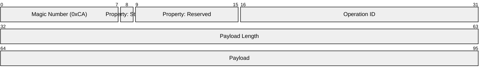

Base interface

```go
type (
    Sender interface {
        Send(uint16 id, data []byte) error
        Stream(uint16 id, r io.Reader) error
    }

    Receiver interface {
        Receive() <-chan Message
    }

    Message interface {
        ID() uint16
    }

    StreamingMessage interface {
        Message
        io.Reader
    }

    BufferedMessage interface {
        Message
        Bytes() []byte
    }
)
```

Message layout could look like this:



The Magic Number indicates the start of the message.
It can be used for resynchronization.
The Operation ID is be provided by the Application.
It is not used by the transport.
Payload length is the amount of data sent in this message.
Payload contains the actual application data.

When the Stream bit is set to 1, it indicates the start of a streaming message.
In this special case, the payload length and actual payload contain the length and data as normal.
The application must not provide an operation ID with the left-most bit set to 1.
That is an error.

The end of the streaming session is indicated by the left-most bit in the Header being 0.

Every subsequent message ID in the streaming message must have the Operation ID with the Streaming bit set to 1.
If that is not the case, it is an error.

## Resynchronization

The protocol includes a 1-byte magic number (0xCA) at the start of each message.
This allows receivers to:
1. Detect message boundaries
2. Resynchronize if they start reading in the middle of a message
3. Validate that they're reading a valid message

If a receiver reads an invalid magic number, it should:
1. Skip one byte
2. Try to read the magic number again
3. Continue until it finds a valid message boundary

This ensures the protocol can recover from:

- Partial reads
- Out-of-sync conditions
- Corrupted data
- Without requiring a TCP connection reset
