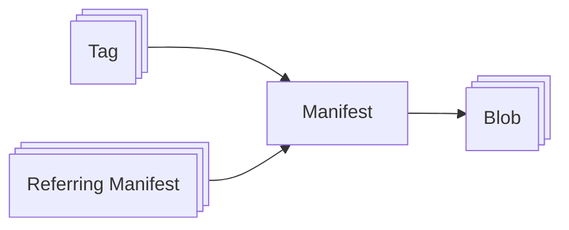
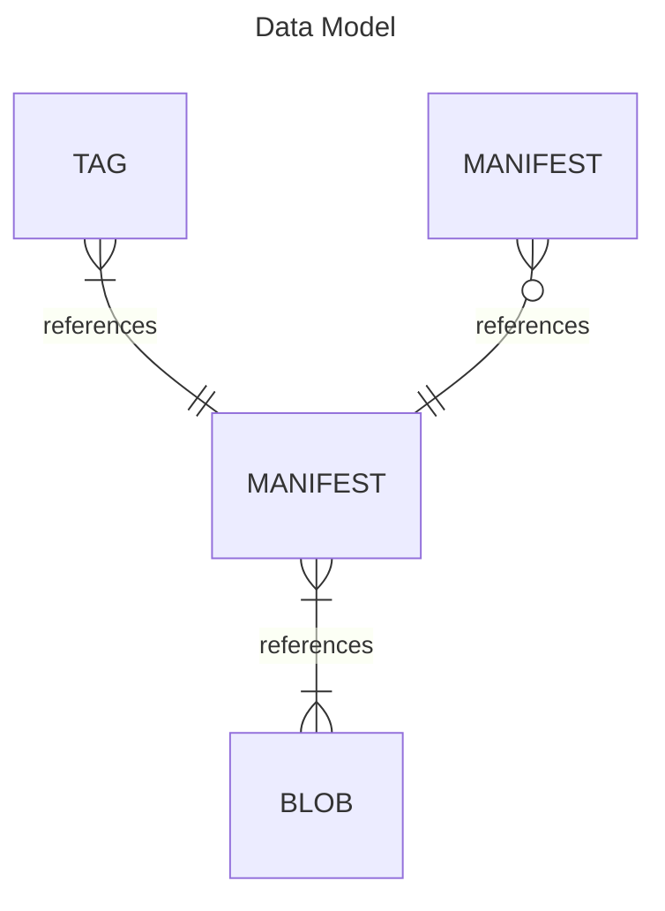

# Design

Outlining the design goals for Cascade Registry, and the problems that it aims to solve.

## Problem Statement

During development of my self-hosted Kubernetes cluster, the need to store and access various artifacts quickly became apparent.
These are artifacts like container images for any custom containers, manifests for GitOps tooling, and OS images for booting nodes.

In recent years, there has been a trend towards storing all kinds of artifacts in container registries, not just container images.
The API of the container registry has been standardized by the Open Container Initiative (OCI) into the OCI Distribution spec, and various tools like ORAS have been developed to store arbitrary data in container registries.
This flexibility and adoption in the Kubernetes ecosystem make container registries (or OCI registries), a natural fit for artifact storage.

There are a number of public OCI registries, like Docker Hub, Quay, or GitHub Container Registry (GHCR) that work fine.
However, hosting a registry on-cluster allows for higher performance because the data is stored locally, and for tighter integration with the cluster.
The idea of a replicated on-cluster registry is also just really cool to me, and that's ultimately the most important.

The cluster will depend on the registry for basic functionality, like serving as a proxy for public registries, hosting manifests for GitOps tools, and hosting VM images for node installation.
Therefore, the registry must be deployed very early, as part of the control plane.
It must also be replicated to be practically useful, and easily orchestrated to enable such early deployment.
It cannot rely on external replicated block or object storage, a CNI, etc...
It can only rely on the vanilla Kubernetes API from a freshly installed cluster.
It must also be able to grow with the control plane, from just one node up to three or five.

There are many open source registries available today.
However, none of them have local replicated storage.
All rely on external object storage like Amazon S3 for replication.
This makes a lot of sense for most registries, as they are built to scale easily and rely on well-established object storage to do the heavy lifting.

There are also a lot open source projects available for replicated object storage.
However, these are also built for very large scales, sometimes spanning multiple datacenters.
Because they are built to scale, they usually have more complex orchestration requirements.
None seemed feasible to orchestrate during the early control plane bootstrapping.

* Many open source registries available
* None available with local replicated storage
* All of them rely on external object storage for replication
* All object storage projects that I found are built for large scales
* All difficult to orchestrate in one way or another

* Most open source registries also don't have online garbage collection

* Tried to use CNCF Distribution and implement a storage driver for NATS Object Storage
* Got it functional but performance was not very good and appeared to be a bit buggy
* Looks like it wouldn't scale well
* NATS was also harder to orchestrate than expected (which I should have looked into first)

* Decided to implement my own registry

## Solution

## Data Model

