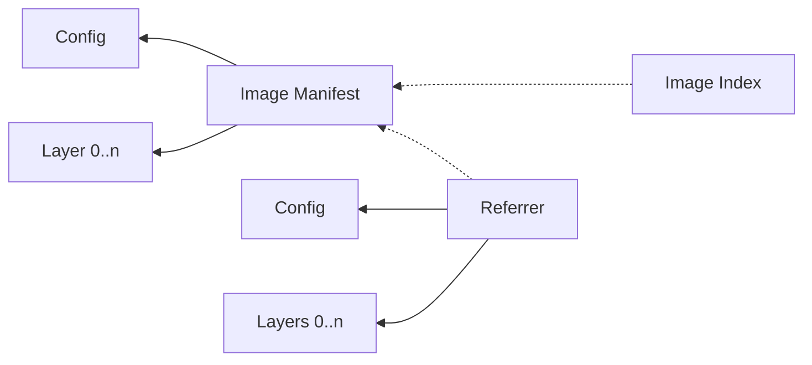

## OCI Artifact

The format of an OCI artifact is defined in the [OCI Image spec][1].
This section contains a summary of the details necessary to understand how a registry handles artifacts.

An OCI artifact consists of:

* **Filesystem layers**: To the registry, filesystem layers are just binary blobs.
* **Configuration**: A JSON file that contains metadata about the artifact.
* **Image manifest**: A JSON file that references the configuration and layers that make up the artifact by their digests.
* **Image index**: A JSON file that references other manifests.

All of the above are identified by their digest.
A digest is a combination of an algorithm and a hash in the format `<algorithm>:<hash>`.
For example, if a manifest was hashed with the SHA256 algorithm, its digest would be something like `sha256:3b9ad...`.
Manifests refer to other objects by their digests, and a manifest is itself referenced by its digest.

An image manifest may also point to another image manifest to form a weak association.
This is called a referrer.
If an image manifest is part of a container image, then the referrer may contain metadata about that image, like a Software Bill-Of-Materials (SBOM).
A referrer points to its own layers and configuration.

Image indices are typically used for multi-platform container images.
For example, if the container image supports AMD64 and ARM64, those are actually two separate sets of layers with their own config and manifest.
An index manifest then points to those two manifests.
A client will pull the index manifest, and use it to resolve the container image for the client's platform.

Putting it all together, we get a dependency graph that looks like this:

Dotted lines indicate optional dependencies.

Manifests are typically tagged to make referring to them easier.
Often tags are semantic versions, but to the registry, they are arbitrary strings (with some limitations).
Tags can only every point to a single manifest, but they may be moved to another manifest.

Clients of the registry typically fetch a tag to get the digest of a manifest.
The manifest is then read to fetch the configuration and layers by their digests.

## Next

Repositories and deduplication?

[1]:https://github.com/opencontainers/image-spec/blob/main/spec.md
