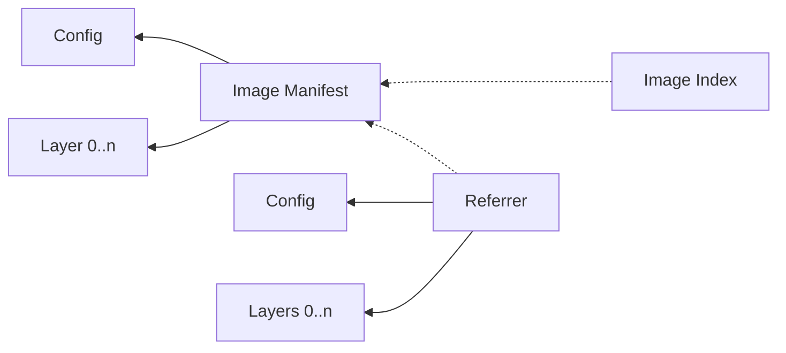
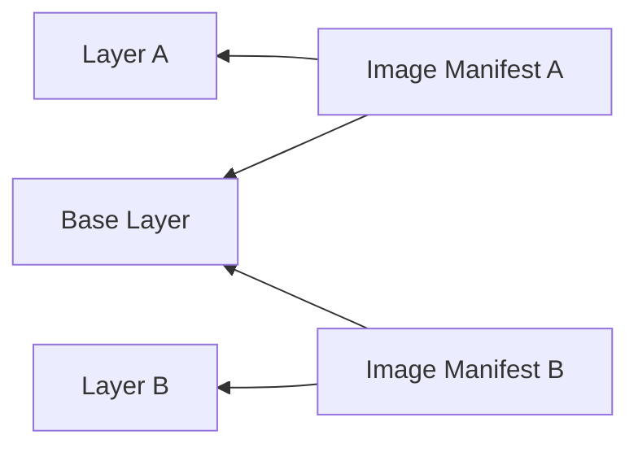
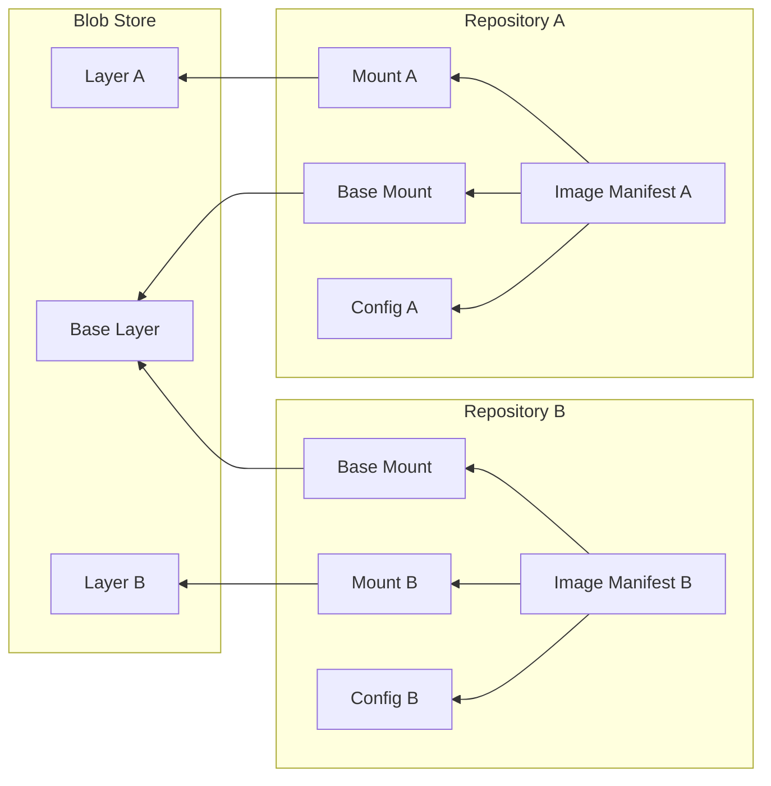

# Storage

## OCI Artifact Structure

To understand why and how the registry stores its data, we need to understand how that data is structured.

The format of an OCI artifact is defined in the [OCI Image spec][1].
This section contains a summary of the details necessary to understand how a registry handles artifacts.

An OCI artifact consists of:

* **Filesystem layers**: One of more TAR archives that may hold complete filesystems, or just individual files.
* **Configuration**: A JSON file that contains metadata about the artifact.
* **Image manifest**: A JSON file that references the layers and configuration that make up the artifact by their digests.
* **Image index**: A JSON file that references other manifests.

All of the above are identified by their digest.
A digest is a combination of an algorithm and a hash in the format `<algorithm>:<hash>`.
For example, if a manifest was hashed with the SHA256 algorithm, its digest would be something like `sha256:3b9ad...`.
Manifests refer to other objects by their digests, and a manifest is itself referenced by its digest.

To the registry, filesystem layers are just binary blobs.
They are never read or inspected beyond calculating hashes to verify their integrity.

An image manifest may also point to another image manifest (called a subject) to form a weak association.
These manifests are called referrers.
If an image manifest is part of a container image, then the referrer may contain metadata about that image, like a Software Bill-Of-Materials (SBOM).
A referrer points to its own layers and configuration.

Image indices are typically used for multi-platform container images.
For example, if the container image supports AMD64 and ARM64, those are actually two separate sets of layers with their own config and manifest.
An index manifest then points to those two manifests.
A client will pull the index manifest, and use it to resolve the container image for the client's platform.

Putting it all together, we get a dependency graph that looks like this:

Dotted lines indicate optional dependencies.

Manifests are typically tagged to make referring to them easier.
Often tags are semantic versions, but to the registry, they are arbitrary strings (with some limitations) that point to a manifest digest.
Tags can only point to a single manifest, but they may be moved to another manifest.

Clients of the registry typically fetch a tag to get the digest of a manifest.
The manifest is then read to fetch the configuration and layers by their digests.
Clients may also fetch manifest by their digest directly, without first using a tag to resolve it.
This is often done for security, as a manifest digest is immutable, while tags are often mutable.

## Deduplication

Because OCI artifacts are made up out of layers, it is possible that two artifacts use some of the same layers.
For example, two container images might be built on top of the same Ubuntu base image.
Some base images can be quite large, leading to a lot duplicated data.
It would be wasteful to upload the same data to the registry multiple times.
That's why the registry deduplicates image layers.
Each layer is stored only once, identified by its digest.

Clients can check if a layer is already present on the registry before deciding to upload it.

## Repositories

In the registry, OCI artifacts are organized into repositories.
Given the container name `example.com/nginx:v1.2.3`:

* `example.com` is the registry host.
* `nginx` is the repository name.
* `v.1.2.3` is the version.

Each repository can hold multiple artifacts, usually identified with tags.
Continuing the example, a repository might hold multiple versions of NGINX.

Repositories serve as scopes for OCI artifacts, and for upload sessions.
Deleting a repository deletes all OCI artifacts within it.
Objects uploaded to one repository should not be accessible from another.

We do still want to make sure that layers can be shared across repositories.
That is why the registry has a shared blob store.
When a layer is uploaded to a repository, the layer is stored into the blob store, and the repository mounts the layer from the blob store.
If a layer is uploaded again to another repository, the data is effectively discarded once the upload is complete, and only a mount is created in the repository.

[1]:https://github.com/opencontainers/image-spec/blob/main/spec.md
