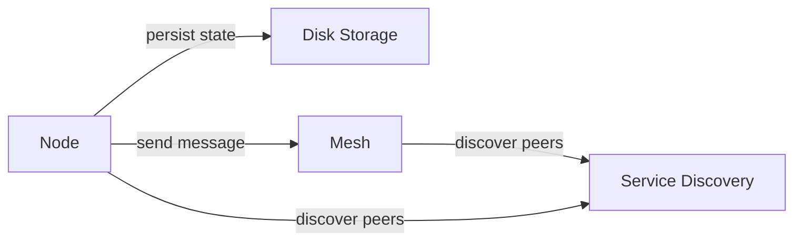

# Scratch

Random rough notes that I need to develop and organize

## Bootstrap

A node always needs to be bootstrapped.
All of the known peers when it starts should be added in the bootstrap.
Do this by ammending a ConfChange entry per entry to the storage.
Then apply each conf change to the Raft state machine.

## Transport

Need some kind of admin or cluster API

Through all this I should remember that Raft is a consensus algorithm
It is not everything about clustering

The cluster package is designed to abstract Raft
It is also decoupled from the Distribution logic
This makes testing easier, and potentially makes reuse easier

Clustering needs at least a few endpoints
For Raft:
* Receiving Raft messages
* Publishing snapshots (eventually)
For Distribution:
* Publishing blobs

Receiving Raft messages is an implementation detail of Raft
But it's very likely that every consensus algorithm has to do this
So I might not want a (cognitively) expensive abstraction
Having a generic messages endpoint receiving a byte slice is probably enough

However, two sources of endpoints means the admin API needs to be pluggable
In other words, it needs to support registering HTTP handlers.

Actually "the Admin API" is a misnomer if it's dynamic
It's more of an "Admin server" that hosts various APIs that are not meant for public clients

So for consensus/Raft we need an API to receive messages and publishes snapshots
Naturally, we also need a client side

Currently, these concerns are tangled up in the Mesh struct:

* Admin server
* Consensus/Raft API
* Consensus/Raft client
* Service discovery

I should untangle these things to make expansions easier.



## Admin server

It's really an HTTP server.

Currently the main Registry server is also a combination of two concerns:

* An HTTP server
* The Distribution HTTP API

The main Registry server could be split up and the HTTP part re-used for the Admin server.


## Service Discovery

```go
package `discovery`

// Service provides information about discovered peers.
type Service interface {}

// InMemoryService discovers Peers in the same process.
// Useful for testing.
type InMemoryService struct {}

// StaticService always returns the same set of Peers.
// Like when peers are passed on commandline.
type StaticService struct {}

// KubernetesService uses Kubernetes Service and Endpoints for discovery.
// It is not responsible for creating them, only reporting changes.
type KubernetesService struct {}
```

## Controller

Maybe I should introduce a Controller or Manager that ties everything together.
It would control the Raft node, like starting and stopping it, and managing its cluster membership.

It could process updates from service discovery in a controlled way.
Having the Node and Mesh process updates individually would certainly lead to race conditions.
